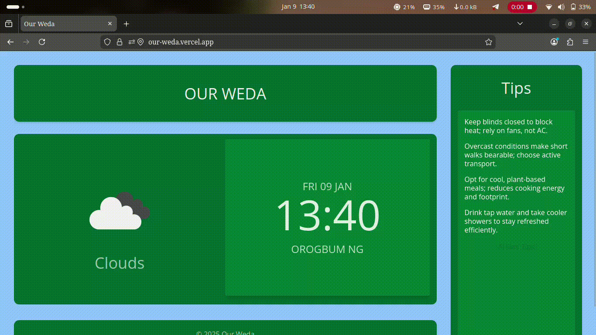
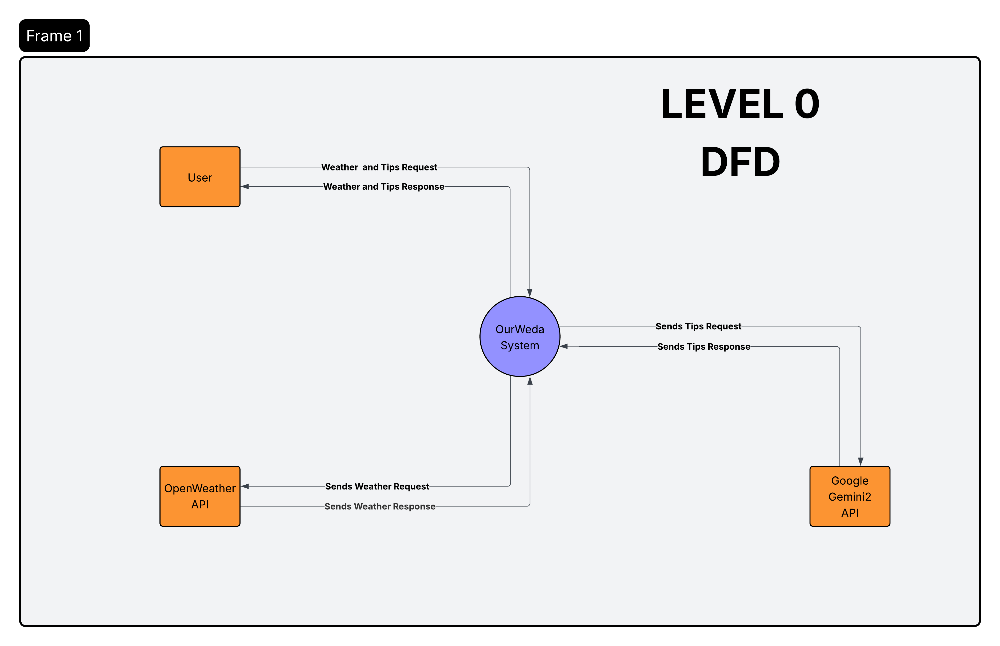
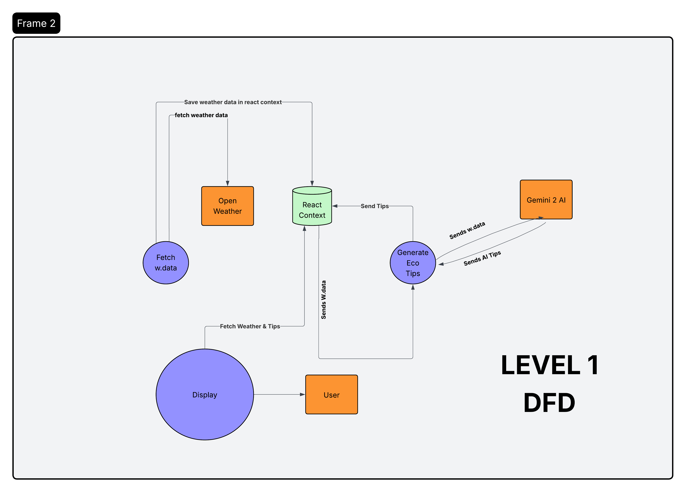

<!-- header -->

<!-- navbar -->
<p align="center">
  <a href="#">Description</a> •
  <a href="#features">Features</a> •
  <a href="#installation">Installation</a> •
  <a href="docs/overview.md">Docs</a> •
  <a href="#license">License</a> •
  <a href="https://www.linkedin.com/in/david-chukwuemeka-870724289/">Linked in</a>
</p>


<p align="center">
  
</p>


<p align="center">
 <h1 align='center'> An AI-Powered Environmental Assistant </h1>

<br>
 
 <!-- badges for license and status of project -->
<p align="center">
  <a href="https://creativecommons.org/licenses/by-nc/4.0/">
    
  </a>
  
</p>

<div align="center">
  
  
</div>

<br>
<br>

# Description

**OurWeda** is an AI-Powered Environmental Assistant that helps users track current weather conditions and get actionable tips to help save the ozone layer and reduce global warming. It fetches weather data using the OpenWeather API, communicates with a FastAPI backend, and interacts with a Gemini 2 AI model to generate custom environmental tips.

---

<br>
<br>

# Tech Stack

- **Frontend:** React, Tailwind CSS, TypeScript
- **Backend:** Python, FastAPI
- **AI:** Gemini 2 Model (via Gemini 2 client)
- **Weather Data Source:** OpenWeather API

---


<br>
<br>


# Demo

**Check out Kronos in action:**

<br>

  


<br>
<br>

# LEVEL 0 DFD

 


<br>
<br>


# LEVEL 1 DFD

 

<br>
<br>

# Features

- View live weather information based on your location
- Receive instant, AI-generated tips to help protect the environment
- Fast, modern interface built with React and Tailwind CSS
- Prompts and suggestions tailored using Gemini 2 model based on current weather
- Tips are practical, categorized as "do" and "do not" actions

---
<br>
<br>


# Installation

<br>


## Prerequisites

- [Node.js](https://nodejs.org/) & npm (for frontend)
- [Python 3.8+](https://www.python.org/) (for backend)
- OpenWeather API key
- Gemini 2 Model credentials/client setup

<br>


## Frontend Setup

### Clone the repository
```
git clone https://github.com/yourusername/ourweather.git
cd ourweather
```
### Install dependencies
```
npm install
```
### Start the frontend
```
npm run dev

```
<br>

## Backend Setup

```

cd backend
```
### (Optional: set up a virtual environment)
```
pip install -r requirements.txt
```
### Start the FastAPI server
```
uvicorn main:app --reload

```

## Environment Variables
```
Create a `.env` file in both frontend and backend directories and add:

OPENWEATHER_API_KEY=your_api_key

GEMINI2_CLIENT_KEY=your_gemini2_key

VITE_OPEN_WEATHER_BASE_URL = https://api.openweathermap.org/data/2.5/weather?

```
## Kindly contact engineer chukwuemekadavid2007@gmail.com for api keys


---

# Usage

1. Open the application in your browser.
2. Enter your location or allow location access.
3. View the current weather and read AI-generated tips right away.
4. Try suggested actionable items to help the planet 🌎!

---

# License

[MIT](LICENSE)

---

## Acknowledgments

- [OpenWeather API](https://openweathermap.org/)
- [Google Gemini 2](https://ai.google)
